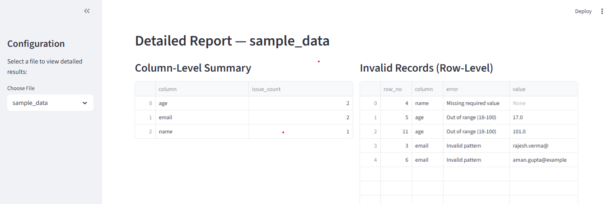
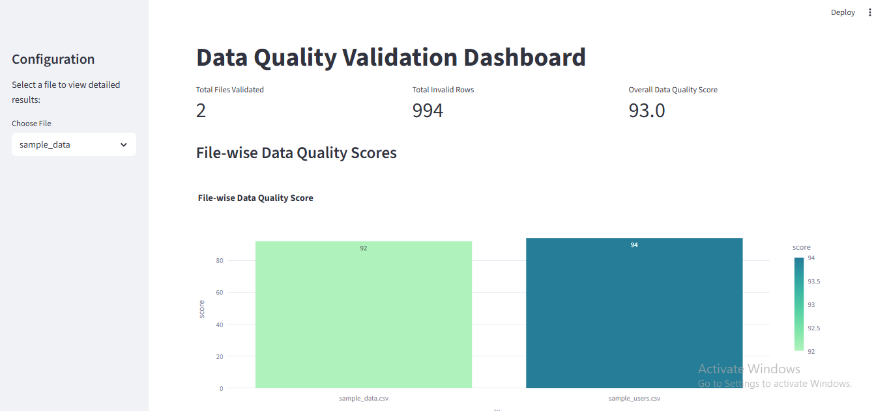
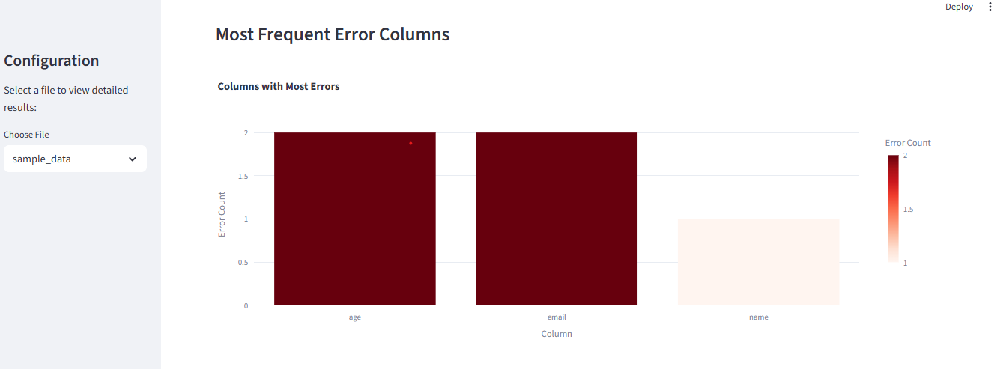

#Data Quality Validator

A modular **Python-based Data Quality Validation Framework** designed to ensure accuracy, completeness, and consistency of data before it enters analytical or ETL pipelines.

This project validates datasets (CSV, Excel, Database, or API outputs) against configurable rules and generates detailed quality reports — helping data engineers and analysts maintain **trustworthy, clean, and reliable data**.

---

## Features

**Config-Driven Architecture** – Easily define validation rules and datasets in YAML/JSON.  
**Rule-Based Validation** – Supports common checks like nulls, duplicates, data type mismatches, regex patterns, and range limits.  
**Dynamic Reporting** – Generates summary and detailed reports in HTML and CSV format.  
**Logging Framework** – Integrated logging for debugging and audit tracking.  
**Modular Design** – Built with scalable and testable architecture (core, utils, config, reports).  
**CLI or Script Execution** – Run validations via command line or integrate as a library in ETL jobs. 

## Project Gallery

Here’s a quick visual walkthrough of the Data Quality Validator in action — from validation to error insights.

 1. Validation Report Summary

Displays all applied rules (Null check, Duplicate check, Regex, Range, etc.) with pass/fail status and detailed record counts.

  

 2. Interactive Dashboard – File-wise Scores

Visualizes overall Data Quality Scores, Invalid Rows, and File-wise performance.

  

 3. Error Analysis – Frequent Error Columns

Shows which columns have the highest number of validation failures.

  

 4. Detailed Record-Level Report

Column-level and row-level validation details with specific failed values and error messages.

  

## Future Enhancements

- Add FastAPI integration for API-based validation triggers  
- Add database connectors (MySQL, PostgreSQL, AlloyDB, etc.)  
- Integrate Kafka for real-time validation  
- Add ML-based anomaly detection module  
- Create scheduling & monitoring dashboard  

## Author

**Aditya Kumar**  
Associate Software Engineer @ Accenture  
🎓 B.Tech in Computer Science (AKTU, 2023)  
📍 Lucknow, India  

📧 [email](mailto:aadikumar.world@gmail.com)  
🌐 [LinkedIn](https://www.linkedin.com/in/adityabkumar/) | [GitHub](https://github.com/aadiVerma07)

